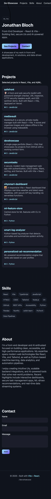
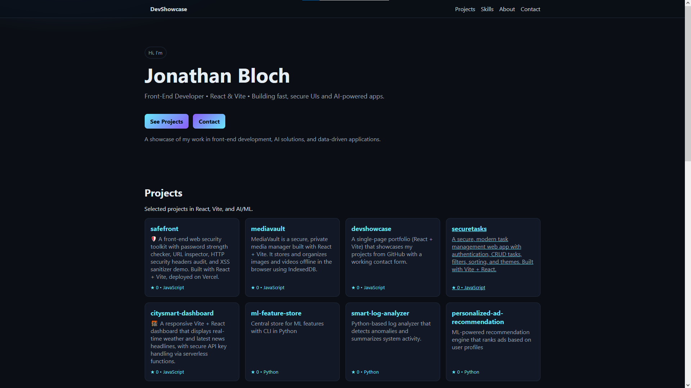

# DevShowcase

**A modern, single-page developer portfolio** built with **React + Vite** that showcases my GitHub projects, skills, and provides a fully functional contact form.  

🌐 **Live Demo:** [https://devshowcase-ten.vercel.app/](https://devshowcase-ten.vercel.app/)

---

## 📌 Features

- **Dynamic Projects Section**  
  Automatically fetches and displays repositories from my GitHub profile (sorted by popularity and recent updates).  
  Only non-forked repos are shown.

- **Skills Overview**  
  Lists my key frontend, backend, AI/ML, and tooling skills.

- **About Me Section**  
  Highlights my background, areas of expertise, and recent work.

- **Fully Functional Contact Form**  
  - Works in local development via direct Formspree POST  
  - Works in production via Vercel serverless function proxy to avoid CORS issues

- **Responsive & Accessible UI**  
  Optimized for mobile, tablet, and desktop devices.

---

## 🛠️ Tech Stack

**Frontend**
- React 18
- Vite
- JavaScript (ESNext)
- HTML5, CSS3

**Backend (Serverless)**
- Vercel Functions (Node.js)
- Formspree API integration

**Data Sources**
- GitHub REST API v3

---

## 🚀 Getting Started

### 1️⃣ Clone the Repository
```bash
git clone https://github.com/YOUR_GITHUB_USERNAME/devshowcase.git
cd devshowcase
```

### 2️⃣ Install Dependencies
```bash
npm install
```

### 3️⃣ Run Locally
```bash
npm run dev
```
The site will be available at **http://localhost:5173/**.

### 4️⃣ Build for Production
```bash
npm run build
```
The production build will be output to the `dist/` folder.

---

## 📄 Deployment

The project is deployed using **Vercel**.  
**Live URL:** [https://devshowcase-ten.vercel.app/](https://devshowcase-ten.vercel.app/)

---

## 🏷️ GitHub Topics

```
react vite javascript portfolio github-api single-page formspree frontend vercel
```

---

## 📸 Screenshots
### Mobile View


### Desktop View


---

## 📬 Contact

If you'd like to work together or discuss opportunities:  
📧 **jonathanbloch100@gmail.com**  
🌐 **[Portfolio](https://devshowcase-ten.vercel.app/)**